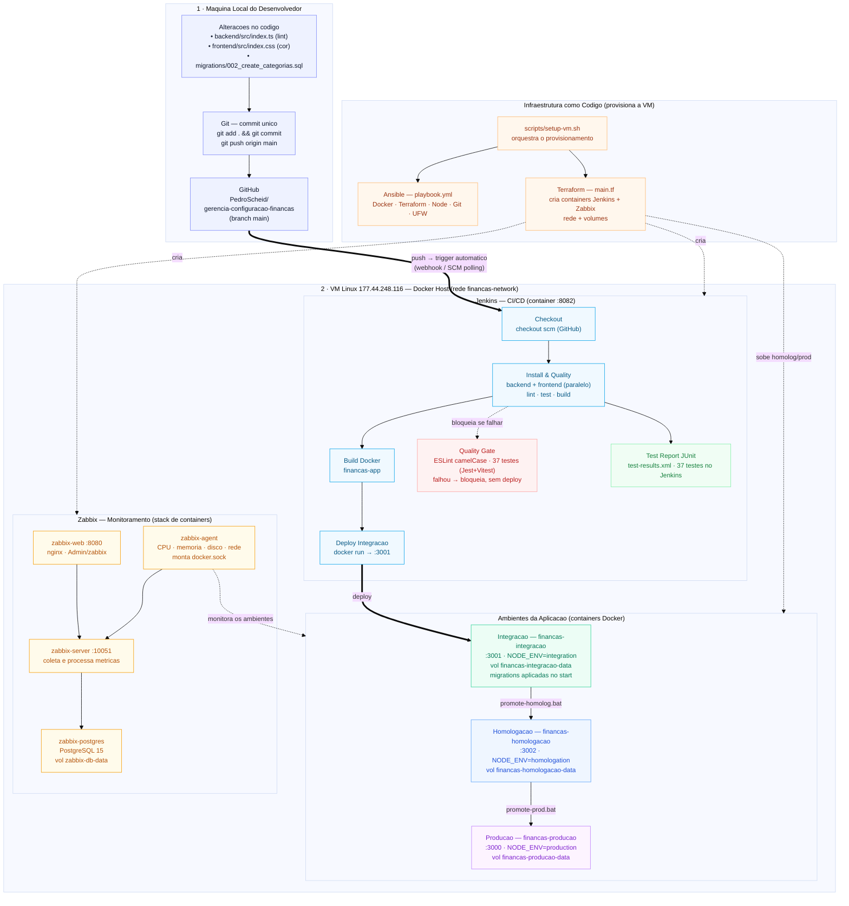

# Arquitetura — Gerência de Configuração / Finanças

CI/CD com Jenkins · Infraestrutura como Código (Terraform + Ansible) · Docker · Monitoramento Zabbix · 3 ambientes.

```mermaid
%%{init: {'theme':'base', 'themeVariables': {'fontSize':'14px'}}}%%
flowchart TB

    subgraph LOCAL["1 · Maquina Local do Desenvolvedor"]
        direction LR
        CODE["Alteracoes no codigo<br/>• backend/src/index.ts (lint)<br/>• frontend/src/index.css (cor)<br/>• migrations/002_create_categorias.sql"]
        GIT["Git — commit unico<br/>git add . &amp;&amp; git commit<br/>git push origin main"]
        GH["GitHub<br/>PedroScheid/<br/>gerencia-configuracao-financas<br/>(branch main)"]
        CODE --> GIT --> GH
    end

    subgraph IAC["Infraestrutura como Codigo (provisiona a VM)"]
        ANSIBLE["Ansible — playbook.yml<br/>Docker · Terraform · Node · Git · UFW"]
        TERRAFORM["Terraform — main.tf<br/>cria containers Jenkins + Zabbix<br/>rede + volumes"]
        SETUP["scripts/setup-vm.sh<br/>orquestra o provisionamento"]
        SETUP --> ANSIBLE
        SETUP --> TERRAFORM
    end

    subgraph VM["2 · VM Linux 177.44.248.116 — Docker Host (rede financas-network)"]

        subgraph JENKINS["Jenkins — CI/CD (container :8082)"]
            direction LR
            S1["Checkout<br/>checkout scm (GitHub)"]
            S2["Install &amp; Quality<br/>backend + frontend (paralelo)<br/>lint · test · build"]
            S3["Build Docker<br/>financas-app"]
            S4["Deploy Integracao<br/>docker run → :3001"]
            S1 --> S2 --> S3 --> S4
            GATE["Quality Gate<br/>ESLint camelCase · 37 testes (Jest+Vitest)<br/>falhou → bloqueia, sem deploy"]
            REPORT["Test Report JUnit<br/>test-results.xml · 37 testes no Jenkins"]
            S2 -. bloqueia se falhar .-> GATE
            S2 --> REPORT
        end

        subgraph ENVS["Ambientes da Aplicacao (containers Docker)"]
            direction TB
            INT["Integracao — financas-integracao<br/>:3001 · NODE_ENV=integration<br/>vol financas-integracao-data<br/>migrations aplicadas no start"]
            HOM["Homologacao — financas-homologacao<br/>:3002 · NODE_ENV=homologation<br/>vol financas-homologacao-data"]
            PROD["Producao — financas-producao<br/>:3000 · NODE_ENV=production<br/>vol financas-producao-data"]
            INT -- "promote-homolog.bat" --> HOM
            HOM -- "promote-prod.bat" --> PROD
        end

        subgraph ZABBIX["Zabbix — Monitoramento (stack de containers)"]
            direction LR
            ZWEB["zabbix-web :8080<br/>nginx · Admin/zabbix"]
            ZSRV["zabbix-server :10051<br/>coleta e processa metricas"]
            ZAGENT["zabbix-agent<br/>CPU · memoria · disco · rede<br/>monta docker.sock"]
            ZDB["zabbix-postgres<br/>PostgreSQL 15<br/>vol zabbix-db-data"]
            ZWEB --> ZSRV
            ZAGENT --> ZSRV
            ZSRV --> ZDB
        end
    end

    GH == "push → trigger automatico<br/>(webhook / SCM polling)" ==> S1
    S4 == "deploy" ==> INT
    ZAGENT -. "monitora os ambientes" .-> ENVS
    TERRAFORM -. "cria" .-> JENKINS
    TERRAFORM -. "cria" .-> ZABBIX
    TERRAFORM -. "sobe homolog/prod" .-> ENVS

    classDef local fill:#eef2ff,stroke:#818cf8,color:#0f172a;
    classDef iac fill:#fff7ed,stroke:#fdba74,color:#9a3412;
    classDef ci fill:#f0f9ff,stroke:#0ea5e9,color:#075985;
    classDef gate fill:#fef2f2,stroke:#fca5a5,color:#b91c1c;
    classDef report fill:#f0fdf4,stroke:#86efac,color:#15803d;
    classDef integ fill:#ecfdf5,stroke:#34d399,color:#047857;
    classDef homol fill:#eff6ff,stroke:#60a5fa,color:#1d4ed8;
    classDef prod fill:#fdf4ff,stroke:#c084fc,color:#7e22ce;
    classDef zbx fill:#fffbeb,stroke:#f59e0b,color:#b45309;

    class CODE,GIT,GH local;
    class ANSIBLE,TERRAFORM,SETUP iac;
    class S1,S2,S3,S4 ci;
    class GATE gate;
    class REPORT report;
    class INT integ;
    class HOM homol;
    class PROD prod;
    class ZWEB,ZSRV,ZAGENT,ZDB zbx;
```
